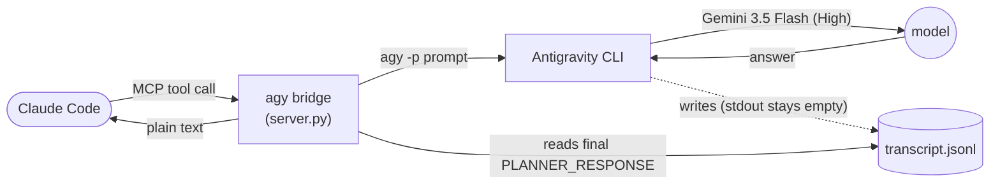

<div align="center">

# Claude Code × Antigravity CLI — MCP Bridge



**Use Google's [Antigravity](https://antigravity.google/) (Gemini 3.5 Flash) as a sub-agent inside [Claude Code](https://claude.com/claude-code) — for text answers *and* image generation, on the AI Pro quota you already pay for.**

[](https://github.com/SinanTufekci/antigravity-intern/actions/workflows/ci.yml)
[](https://pypi.org/project/antigravity-intern/)
[](LICENSE)
[](https://www.python.org/)
[](https://modelcontextprotocol.io/)
[](https://antigravity.google/)
[](#requirements)
[](https://github.com/sponsors/SinanTufekci)

</div>

---

`agy`, Google's Antigravity CLI, ships a headless print mode (`agy -p`) that's **broken**: it
authenticates, talks to the model, gets the answer back… and then writes it to the *controlling
terminal* instead of its stdout — so anything capturing stdout gets nothing (and, run under a TUI,
agy's text leaks straight into the host's prompt). This bridge runs `agy -p` anyway, **detaches it
from your terminal** so it can't leak, reads the answer straight out of agy's *own* transcript
files, and hands it to Claude Code as clean MCP tools. Delegate cheap tool-calling work to Gemini
without leaving your terminal.

> [!WARNING]
> **This runs unsandboxed code with your privileges.** `agy -p` auto-executes its tools
> (read/write files, run shell commands, reach the network) with **no usable approval gate**.
> `--sandbox` (fixed for `-p` in agy 1.0.6+) blocks only *shell commands* — file writes and
> network egress stay wide open — so it's no real boundary. The `workspace` argument is a
> *starting context*, **not** a security boundary. Only use it with **trusted prompts on trusted
> content**; for real isolation, run the bridge inside a container or VM. **[Full details →](#security)**

## Why you'd want this

| | |
|---|---|
| 🧠 **Second opinion** | Ask a different model family mid-task without switching tools. |
| 🎨 **Image generation** | Have Gemini draw an image and get the saved file back — no extra API key or image tool. |
| 💸 **Cheap delegation** | Burn Antigravity AI Pro quota on grunt work instead of Claude tokens. |
| 📁 **Cross-repo reads** | Point it at another project directory and let Gemini read/answer there. |
| 🔌 **Zero new auth** | Piggybacks the login you already did in the Antigravity IDE — no keys to manage. |

## How it works



`agy -p` persists its real answer — the one it never sends to stdout — to:

```
~/.gemini/antigravity-cli/brain/<conv-id>/.system_generated/logs/transcript.jsonl
```

The bridge runs agy, locates the conversation via `cache/last_conversations.json` (falling back to
the newest `brain/` directory touched since launch), streams the transcript, and returns the final
`source=MODEL, status=DONE, type=PLANNER_RESPONSE` entry — the answer, minus the intermediate
tool-calling steps. `antigravity_continue` pins the workspace's **exact** conversation id via
`--conversation`, so it never resumes the wrong thread.

## Set up in 60 seconds

**Prerequisite (either method):** install agy and sign in to Antigravity **once** (via the IDE or
`agy -i`) so it has a credential to reuse.

### Recommended — no clone, auto-updating

With [`uv`](https://docs.astral.sh/uv/) installed, register the bridge straight from
[PyPI](https://pypi.org/project/antigravity-intern/) under `mcpServers` in `~/.claude.json` — no
path to hardcode, no `git pull` to remember:

```json
"antigravity-intern": {
  "command": "uvx",
  "args": ["antigravity-intern@latest"]
}
```

The `@latest` suffix matters: it makes uvx fetch the newest published release on each launch (i.e.
every Claude Code restart). Plain `uvx antigravity-intern` would pin to the first version it cached
and **not** auto-upgrade. Drop `@latest` if you'd rather pin and upgrade manually.

### From source

Clone it instead if you want to hack on the bridge or pin a local copy:

```bash
git clone https://github.com/SinanTufekci/antigravity-intern.git
cd antigravity-intern
pip install fastmcp
python test_smoke.py        # 3 real round-trips (ask, continue, image) — should print three PASS lines
```

> [!NOTE]
> The smoke test costs a tiny bit of AI Pro quota and takes ~30–60 s.

Then point Claude Code at the absolute path to `server.py` under `mcpServers` in `~/.claude.json`:

<table>
<tr><th>Windows</th><th>macOS / Linux</th></tr>
<tr><td>

```json
"antigravity-intern": {
  "command": "python",
  "args": ["C:\\path\\to\\server.py"]
}
```

</td><td>

```json
"antigravity-intern": {
  "command": "python3",
  "args": ["/path/to/server.py"]
}
```

</td></tr>
</table>

Restart Claude Code. Eight tools appear: **`antigravity_ask`**, **`antigravity_continue`**, **`antigravity_ask_watch`**, **`antigravity_image`**, **`antigravity_image_watch`**, **`antigravity_swarm`**, **`antigravity_image_swarm`**, and **`antigravity_status`** (each prefixed `mcp__antigravity-intern__`).

> *"Use antigravity_ask to summarize the README of this repo in three bullets."* → Claude routes the prompt
> through the bridge, agy reads the file under the workspace root, and the answer comes back as a
> plain string.

## Tools

| Tool | Purpose |
|---|---|
| `antigravity_ask(prompt, workspace?, timeout_s?=180)` | Start a **new** Antigravity conversation. |
| `antigravity_continue(prompt, workspace?, timeout_s?=180)` | Continue the conversation **rooted at `workspace`** (pinned by id). |
| `antigravity_ask_watch(prompt, workspace?, timeout_s?=180)` | 🧪 **Experimental.** Like `antigravity_ask`, but opens the **Antigravity Intern** live browser window so you can watch agy work (see [Watch mode](#watch-mode)). |
| `antigravity_image(prompt, output_path?, workspace?, timeout_s?=240)` | Generate an image with Antigravity; saves the file (extension corrected to the real bytes) and returns its path + format/size. |
| `antigravity_image_watch(prompt, output_path?, workspace?, timeout_s?=240)` | 🧪 **Experimental.** Like `antigravity_image`, but streams progress and **shows the generated image** in the Antigravity Intern window. |
| `antigravity_swarm(prompts, workspaces?, max_concurrency?=4, timeout_s?=180, watch?=false)` | Run **several prompts in parallel** as independent agy workers; returns every answer in one block (see [Swarm](#swarm)). |
| `antigravity_image_swarm(prompts, output_paths?, workspaces?, max_concurrency?=4, timeout_s?=240, watch?=false)` | Generate **several images in parallel** (one worker per prompt). |
| `antigravity_status()` | Offline setup diagnostics (agy version/compat, state dirs, newest transcript readable). Spends no quota. |

`workspace` defaults to the MCP server's current working directory. Point it at a real project dir
for context-aware answers — agy gives the model access to files under that root.

`antigravity_image` forces agy to save to an explicit absolute path — without one, agy
falls back to its own scratch dir (`~/.gemini/antigravity-cli/scratch/`). It then
corrects the file extension to match the real bytes: agy's image model picks the
format itself (JPEG for photo-like images, PNG for flat graphics), so a requested
`out.png` may come back as `out.jpg`. The returned path always reflects the true
format.

<a id="watch-mode"></a>

## 👁️ Watch mode — Antigravity Intern (experimental)

`antigravity_ask_watch` / `antigravity_image_watch` do the same work as `antigravity_ask` / `antigravity_image`, but
let you **watch agy work live in a little terminal-style browser window** called
**Antigravity Intern**. agy still runs headless; alongside it the bridge serves a tiny page on
`127.0.0.1` and opens it in a small, chromeless app window that streams agy's steps —
its planner narration (▸), the **real commands** it runs (`$`), and completions (✓) —
read live from the transcript, with the final answer rendered as Markdown (and, for
`antigravity_image_watch`, the generated image shown inline).

- **Cross-platform & best-effort.** Prefers a Chromium browser (`--app` mode) for the
  windowed look; falls back to a normal browser window. If nothing can open, the run
  still completes and returns normally.
- **Window size.** Set **`AGY_WATCH_WINDOW_SIZE`** (e.g. `AGY_WATCH_WINDOW_SIZE=480,700`)
  to resize the window; default is `560,760`. Press **Enter / Esc** in the window to
  close it.
- **Coarse, not token-level.** agy flushes its transcript in chunks, so you get a
  handful of live steps, not character streaming. The returned value is identical to
  the non-watch tool. Nothing is sent anywhere but your own machine.

<a id="swarm"></a>

## 🐝 Swarm — run agy workers in parallel

`antigravity_swarm` and `antigravity_image_swarm` fan a list of prompts out to
**independent agy workers that run truly concurrently** (capped at
`max_concurrency`, default 4), then return every worker's result in one block.
Good for independent, cheap sub-tasks — summarise N files, ask the same question
about N repos, generate N images — without paying for them one at a time.

```
antigravity_swarm(prompts=[
  "Summarise src/auth.py in 2 bullets.",
  "Summarise src/db.py in 2 bullets.",
  "List the public functions in src/api.py.",
])
```

**How it stays correct under concurrency.** The single-agent tools serialize
through a lock because agy rewrites `last_conversations.json` on every call, so
concurrent runs sharing one state dir would race. The swarm sidesteps this
entirely: each worker runs with its **own isolated `HOME`/`USERPROFILE`**, so
agy's `brain/`, `cache/`, and `last_conversations.json` never collide — no lock
needed. Auth still works because agy reads it from the **OS credential store**,
not from `~/.gemini` (verified on agy 1.0.9). Each worker's `cwd` is still its
real `workspace`, so file access there is unchanged — HOME redirection isolates
*state only*. Measured ~**2.8× speedup at 3 workers** (the AI Pro backend does
not serialize per-account); higher `max_concurrency` trades quota/rate-limit
pressure for wall-clock.

- **`workspaces`** — omit for the server cwd; pass a **1-item list** to point every
  worker at the same dir; pass **one entry per prompt** for per-worker dirs.
- **Error isolation** — a worker that fails is reported in place; the others still
  return.
- **`watch=true`** — opens a thin live **Antigravity Swarm** dashboard (one row per
  worker showing the repo, prompt, and latest step). **Click a row** to pop that
  agent out into its own window streaming its full step log, beside the dashboard.

> [!WARNING]
> A swarm launches **N unsandboxed agy agents at once** — N× the prompt-injection
> "lethal trifecta" surface of a single call (see [Security](#security)). Only use
> it with **trusted prompts on trusted content**.

## Model & auth

- **Model:** effectively **Gemini 3.5 Flash (High)** — whatever the `"model"` field in agy's
  `settings.json` is set to. agy 1.0.5 added a `--model` flag (and a `models` subcommand) that *is*
  wired into print mode, but **switching to a different model in `-p` hangs the call** (verified on
  1.0.5: passing the already-active label returns in seconds, any other label hangs >60 s). So the
  bridge stays single-model; change it via agy's `settings.json` if you need a different one. Flash
  High is speed-optimized for tool-calling, so this fits best as a *fast sub-agent for cheap work*,
  not a heavy reasoning partner.
- **Auth:** piggybacks whatever credential store `agy` uses on your OS (Windows Credential Manager,
  macOS Keychain, libsecret on Linux — the bridge never touches it directly). Log in once; every
  call after that silent-auths on the **same AI Pro quota** you already pay for.

<a id="security"></a>

## ⚠️ Security

`agy -p` runs the model as an **autonomous agent that auto-executes its own tools** — reading and
writing files, running shell commands, and reaching the network — with **no approval gate and no
opt-out**. This isn't a choice the bridge makes; it's how agy's print mode works. Re-verified
empirically on **agy 1.0.9 / Windows** (all three checks below still hold):

- Print mode runs out-of-workspace file writes and live network fetches **even without**
  `--dangerously-skip-permissions` — that flag is a **no-op** for `-p`. There is **no** agy flag
  that disables tool execution in print mode.
- agy 1.0.5 integrated a permission system (its logs show `toolPermission=request-review`), but it
  **still does not gate print-mode execution** — a fresh `-p` run created a file outside the
  workspace with no prompt.
- `--sandbox` is **not** a usable boundary. agy 1.0.6 fixed its propagation into `-p` (the 1.0.6/1.0.7
  changelog calls this "sandbox isolation correctly enforced") and it now **does** block terminal/
  shell command execution — but re-verified on 1.0.9 that it leaves the `write_to_file` tool and
  network **wide open**: under `--sandbox` the model still wrote a file *outside* its workspace. agy
  1.0.9 hardened the sandbox's *command* path (stricter exact-match command checks; `.git` added to
  its dangerous-paths list), but none of that closes the out-of-workspace `write_to_file` hole. On
  top of that, a `--sandbox` run whose blocked terminal command halts it writes **no JSONL
  transcript** (only the SQLite `.db`, re-confirmed on 1.0.9), so the bridge couldn't read a
  response — so the bridge deliberately never passes `--sandbox`.

**What that means for you:**

- The `workspace` argument is only a *starting context*, **not a security boundary** — the agent
  can and does act outside it.
- Every call effectively runs **arbitrary code with your user privileges**.
- Only invoke this with **trusted prompts on trusted content**. Untrusted input here is the classic
  prompt-injection *lethal trifecta*: private-data access + code execution + network egress.
- For real isolation, run the **whole bridge inside a container or VM**.

The bridge itself does only cross-platform filesystem reads under `~/.gemini/antigravity-cli/` — no
private APIs, no token theft. The risk above is entirely in what the agy sub-agent is allowed to do.

## FAQ

<details>
<summary><b>Is this against Google's Terms of Service?</b></summary>

It runs the **official `agy` CLI under your own AI Pro session** — no private APIs, no token theft,
no quota abuse. It just bridges what the CLI already does. That said, your AI Pro / Antigravity ToS
apply, and you're responsible for staying within them.
</details>

<details>
<summary><b>Will it break when agy updates?</b></summary>

Possibly — it reads agy's **internal, undocumented** state files, so a release can change paths or
schemas and break it silently. Re-verified working on **1.0.9** (transcript schema and `-p` JSONL
output unchanged; live ask/continue/image round-trips pass). The known future risk is agy's
**SQLite (`.db`) conversation format** (added in 1.0.4, slated to become the default): agy 1.0.9
still **dual-writes** every conversation to `~/.gemini/antigravity-cli/conversations/<id>.db`
alongside the JSONL transcript, so once it stops writing JSONL the reader needs a SQLite path. Pin a
known-good `agy` version if you depend on this.
</details>

<details>
<summary><b>Why only Gemini 3.5 Flash?</b></summary>

agy 1.0.5 added a `--model` flag, but switching to a different model in `-p` **hangs** (print mode
waits on a step it never gets headless), so in practice you get whatever model agy's `settings.json`
selects — Gemini 3.5 Flash (High) by default. The bridge doesn't expose a model knob because it
would hang on any real switch.
</details>

<details>
<summary><b>Can it generate images?</b></summary>

**Yes — that's the `antigravity_image` tool.** agy's print mode generates real images on
your AI Pro quota; `antigravity_image` drives it, saves the file to a path you choose (or
a timestamped default in your workspace), fixes the extension to match the real
bytes (agy picks JPEG or PNG itself), and returns the path. Verified on **agy 1.0.9 / Windows**.
It's request/response only and runs a normal, unsandboxed agy session (see
[Security](#security)).
</details>

<details>
<summary><b>Does it cost extra money?</b></summary>

No. It uses the same **AI Pro quota** you already pay for. The smoke test spends a negligible
amount.
</details>

<details>
<summary><b>Does it stream responses?</b></summary>

The final answer is request/response — `agy -p` returns it all at once, so the tools return when agy
finishes (each call typically takes 10–30 s). If you want to *watch* agy work as it goes, use the
experimental **watch mode** (`antigravity_ask_watch` / `antigravity_image_watch`): it opens the
**Antigravity Intern** browser window and live-streams agy's steps read from the transcript — see
[Watch mode](#watch-mode). It's coarse (a handful of steps, not token-by-token), and the returned
value is identical to the non-watch tool.
</details>

<details>
<summary><b>Can I run several calls at once?</b></summary>

The **single-agent** tools (`antigravity_ask` / `antigravity_continue` / `antigravity_image`) are
**serialized** inside the server: agy rewrites `last_conversations.json` on every call, so concurrent
runs sharing one state dir would race and could return the wrong conversation. A `threading.Lock`
makes extra requests queue rather than race.

For real parallelism use **[`antigravity_swarm`](#swarm)** — it runs each worker in its own isolated
state dir, so they don't race and the lock isn't needed (~2.8× at 3 workers). That's the supported
way to run many agy calls at once.
</details>

## Status & caveats

- ✅ **Verified on agy 1.0.9** — base dir, `last_conversations.json`, the
  `brain/.../transcript.jsonl` path, the transcript schema, and the `-p`/`-c`/`--print-timeout`
  flags are all unchanged; live ask/continue/image round-trips all pass. The 1.0.5 `-p` metadata fix
  also means agy no longer litters the workspace dir.
- 🖥️ **Console-detach (new)** — agy `-p` writes its progress/answer to the *controlling terminal*,
  not stdout; under a TUI that text leaks into the host's prompt (seen on 1.0.9 before the fix). The
  bridge now spawns agy detached from the terminal (`CREATE_NO_WINDOW` / a new POSIX session), so it
  can't leak; the answer is still read from the transcript.
- ⏳ **SQLite migration is the real risk** — agy 1.0.9 still dual-writes a `.db` per conversation;
  see the [FAQ](#faq). `_read_response` raises a clear, SQLite-aware error if the JSONL transcript
  ever disappears.
- 🐛 **Stdout bug persists** — `-p` still doesn't print the answer to stdout on 1.0.9 (the 1.0.9
  "print-mode resumption" changelog fix did **not** change this for fresh `-p`). If a future release
  fixes stdout, this workaround becomes redundant but harmless.
- 👁️ **Watch mode is experimental** — `antigravity_ask_watch` / `antigravity_image_watch` open the **Antigravity Intern**
  browser window to watch agy work live (coarse steps; image shown inline). Best-effort and
  cross-platform; see [Watch mode](#watch-mode).
- 🔒 **No real sandbox** — agy's `--sandbox` (since 1.0.6) blocks only shell commands in `-p` but still
  leaves file writes and network egress open (and breaks transcript reading), so it's no boundary;
  see [Security](#security).

## Requirements

- Python 3.10+
- [`agy`](https://antigravity.google/) 1.0.0 or newer on `PATH` (state-file layout re-verified on **1.0.9**)
- An active Antigravity / AI Pro session

> [!TIP]
> If `agy` isn't reliably on `PATH` (e.g. a new terminal or reboot drops it on Windows), set the
> **`AGY_BIN`** env var to its full path and the bridge will use that instead of `"agy"` — e.g.
> `AGY_BIN=%LOCALAPPDATA%\agy\bin\agy.exe`.

The bridge uses only cross-platform Python (`Path.home()`, `subprocess`) and reads paths under
`~/.gemini/antigravity-cli/`, which `agy` writes the same way on every OS. **Developed and verified
on Windows; macOS and Linux should work unmodified provided `agy -i` runs there.** If you test it on
those platforms, please open an issue / PR to confirm.

## Development

```bash
pip install -e ".[dev]"          # fastmcp + pytest + ruff
pytest test_server.py test_swarm.py   # offline unit tests — no agy, no quota
ruff check . && ruff format --check .
```

`test_server.py` and `test_swarm.py` cover the pure parsing/version/swarm logic with temp fixtures
(no agy needed); `test_smoke.py` is the live end-to-end check (ask, continue, image, and a parallel
swarm) that spends a little quota. Set **`AGY_BRIDGE_DEBUG=1`**
to log per-call diagnostics (resolved conversation id, agy exit code, elapsed) to stderr — and on
startup the server warns if your installed agy is newer than the version it was verified against.

**Staying up to date.** A `uvx antigravity-intern@latest` install fetches the newest release on each
launch (uvx caches by default, so the `@latest` suffix is what keeps it current — plain
`uvx antigravity-intern` pins to the first-cached version). A `git clone` does not auto-update —
pull and restart Claude Code. Either way, nothing updates a *running* server; new versions are
picked up on the next Claude Code restart. To make that visible, on startup the server polls the
GitHub tags API once and logs a one-line warning to stderr if a newer release tag exists than the
running code (`__version__` in `server.py`). The check is best-effort — silent when offline or
rate-limited, never blocks startup. Control it with:

| Env var | Effect |
|---|---|
| `AGY_BRIDGE_NO_UPDATE_CHECK=1` | Skip the GitHub check entirely (fully offline startup). |
| `AGY_BRIDGE_REPO=owner/name` | Point the check at a fork instead of the upstream repo. |

**Releasing.** Bump the version in **both** `pyproject.toml` and `server.py` (`__version__`), update
[`CHANGELOG.md`](CHANGELOG.md), then tag:

```bash
git tag vX.Y.Z && git push origin vX.Y.Z
```

The tag triggers two workflows: `release.yml` cuts a GitHub Release with auto-generated notes, and
`publish.yml` builds and uploads to PyPI via [Trusted Publishing](https://docs.pypi.org/trusted-publishers/)
(no stored token — `publish.yml` verifies the tag matches `pyproject.toml` first). One-time setup:
register the trusted publisher at `pypi.org/manage/project/antigravity-intern/settings/publishing/`
(repo `SinanTufekci/antigravity-intern`, workflow `publish.yml`, environment `pypi`).

## Contributing

Personal project, **best-effort maintenance** — issues and PRs welcome, but no uptime/compat
promises. If `agy -p` ever starts printing to stdout correctly, this whole repo becomes a fun
historical artefact.

## 🌐 Community & Acknowledgments

- **Qiita (Japan):** A huge thanks to `@fallout` and the Japanese developer community for featuring this project and providing invaluable feedback!
  - [Detailed Hybrid Setup Guide (Claude Code × Antigravity CLI)](https://qiita.com/fallout/items/5097f0575b58f4c69b81)
  - [Quick Installation Guide](https://qiita.com/fallout/items/d699df3d6931c07eb38d)

> 💡 **Path Resolution Fix:** Thanks to their community's real-world testing, we identified and resolved a Windows PATH edge case where the MCP server inherits a *stale* `PATH` at startup and can't find `agy`. The `AGY_BIN` environment-variable fallback was implemented directly inspired by their report!

## License

[MIT](LICENSE). Do whatever you want with it.
